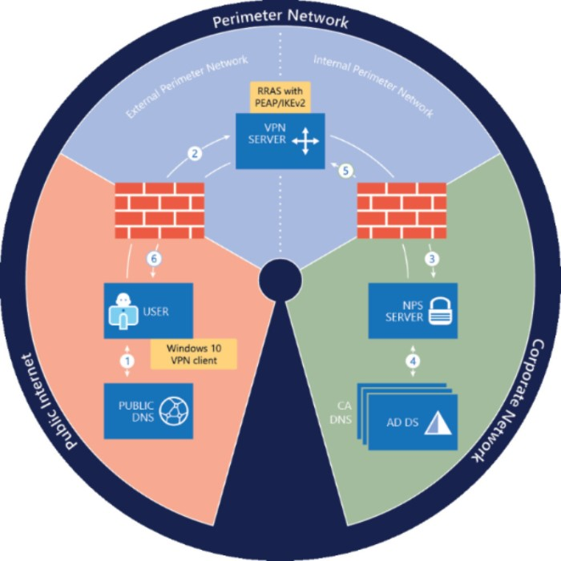

# Понимание Always On VPN в Windows 10

Always On VPN в Windows 10 это следующий этап развития решения Microsoft для организации безопасного доступа клиентов к корпоративной сети. Always On VPN призвано заменить DirectAccess.

Основная документация по Always On VPN размещена [на сайте Microsoft](https://docs.microsoft.com/en-us/windows-server/remote/remote-access/vpn/always-on-vpn/). На данном сайте представлен авторский вариант последовательности шагов по настройки решения в корпоративной сети со своими комментариями.

## Общая схема организации решения Always On VPN

	1. Используя общедоступные DNS-серверы, VPN-клиент Windows 10 выполняет запрос разрешения имен для IP-адреса VPN-шлюза.
	2. Используя IP-адрес, возвращенный службой DNS, VPN-клиент отправляет запрос на подключение к VPN-шлюзу.
	3. VPN-шлюз также настраивается как клиент протокол RADIUS (RADIUS). VPN-клиент RADIUS отправляет запрос на подключение к серверу NPS организации или организации для обработки запроса на подключение.
	4. Сервер политики сети обрабатывает запрос на подключение, включая выполнение авторизации и проверку подлинности, а также определяет, следует ли разрешать или запрещать запрос на соединение.
	5. Сервер политики сети перенаправляет ответ доступа-Accept или Access-DENY на VPN-шлюз.
	6. Подключение инициируется или прерывается в зависимости от ответа, полученного от сервера политики сети.

## Требования

	– Для AlwaysOn VPN можно использовать сервера Windows Server 2012 R2 (RRAS/NPS/AD CS) или решение (VPN и RADIUS) от других вендоров, RRAS-сервер не может быть развернут в Azure VM
	– Windows 10 Pro (user VPN-profile)/Enterpris (PC VPN-profile)
	– IPv4 или IPv6
	– Windows 10 Anniversary Update (версия 1607) или новее
	– ПК в домене (расширенные возможности) - Enterprise и без (ограничения) - Pro
	– Протокол IKEv2
	– Управлять через Intune/Microsoft Endpoint Configuration Manager/PowerShell
    - Статический пул адресов для подключаемых VPN-клиентов

## Возможности

	– Фильтрация трафика
	– VPN, запускаемый приложением
	– Условный доступ (Azure Active Directory Premium) и соответствие устройств
    - Тунель для пользователя и тунель для устройства можно совмещать

## Always On VPN vs DirectAccess

## Always On VPN: Device Tunnel vs Always On VPN User Tunnel

|	Device Tunnel								|	User Tunnel	|
|-----------------------------------------------|---------------|
| Невидимо в GUI								| Отображается в GUI |
| Без NPS										| Необходим NPS |
| Сертификат проверятеся на RRAS				| Сертификат проверяется на NPS |
| Нельзя отозвать сертификат в Windows Server 2012R2, для других необходимо [устанавливать обновления и создавать ключ в реестре на VPN-серверах](https://directaccess.richardhicks.com/2019/06/20/always-on-vpn-device-tunnel-and-certificate-revocation/)	| Можно отозвать сертификат пользователя 				|
| Windows 10 Enterprise (domain)				| Windows 10 Pro (workgroup) |
| Не возможно использовать условный доступ		| Можно использовать условный доступ через Azure |
| Нет MFA										| Есть MFA |
| Использует только IKEv2 (UDP 500, UDP 4500)	| Можно использовать SSTP (TCP 443) |
| Можно включить фильтрацию трафика, в таком случае весь входящий трафик будет заблокирован. Как вариант использовать маршруты с префиксом IP-адреса /32.	| 	|

## Схема работы туннель пользователя

	1. Клиент VPN отправляет запрос на подключение на внешний IP-адрес VPN-сервера
	2. Краевой брандмауэр передает запрос на подключение к внешнему интерфейсу VPN-сервера
	3. VPN-сервер передает запрос на подключение на сервер RADIUS. Запрос на подключение выходит через внутренний интерфейс VPN-сервера и проходит через внутренний брандмауэр
	4. Сервер RADIUS получает и аутентистиирует запрос на подключение
	5. Сервер RADIUS возвращает прием или отказ в ответе на VPN-сервер
	6. VPN-сервер позволяет или отказывает в запросе на подключение на основе ответа с сервера RADIUS

## Схема работы туннель устройства

	1. Клиент VPN отправляет запрос на подключение на внешний IP-адрес VPN-сервера
	2. Краевой брандмауэр передает запрос на подключение к внешнему интерфейсу VPN-сервера
	3. VPN-сервер проверяет сертификат проверки подлинности компьютера клиента и позволяет или отрицает запрос на подключение

## LAB параметры
	– Внутренний домен: ms-ware.local (192.168.0.x/24)
	– DMZ: 10.10.10.x/24
	– Внешний домен: ms-ware.ru (c:\windows\system32\drivers\etc\hosts)
	[10.10.10.3	aovpn.ms-ware.ru]
	– Адрес подключения AlwaysOn VPN: aovpn.ms-ware.ru (10.10.10.3)
	– AD DC/DNS/DHCP/AD CS: dc.ms-ware.local (192.168.1.1)
	– Адрес размещения crl-файла: http://pki.ms-ware.ru
	– NPS (RADIUS-сервер): nap.ms-ware.local (192.168.1.2)
	– RAS (VPN-сервер в DMZ): vpn.ms-ware.local (192.168.1.3/10.10.10.3)
	
> **Предупреждение**
> [Прежде чем приступить к работе, обязательно включите IPv6 на VPN-сервере. В противном случае соединение не может быть установлено, и отображается сообщение об ошибке.](https://docs.microsoft.com/ru-ru/windows-server/remote/remote-access/vpn/always-on-vpn/deploy/vpn-deploy-ras)
		
	– Доменный ПК: W10-01.ms-ware.local (Enterprise)
	– ПК в рабочей группе: W10-02 (Pro)
	– Пользователи AlwaysOnVPN: ms-ware\User1; ms-ware\User2 (password:P@$$w0rd)
	- Доступность портов на VPN-сервере: UDP 500, UDP 4500.

